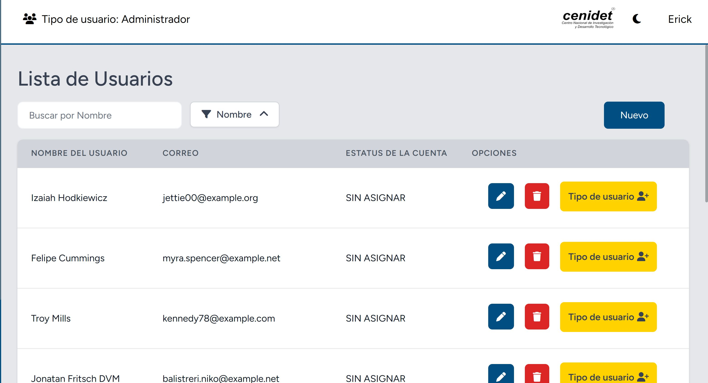
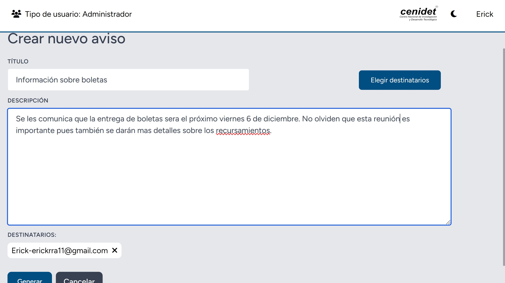
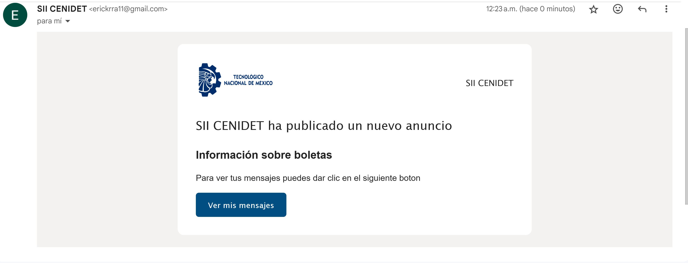
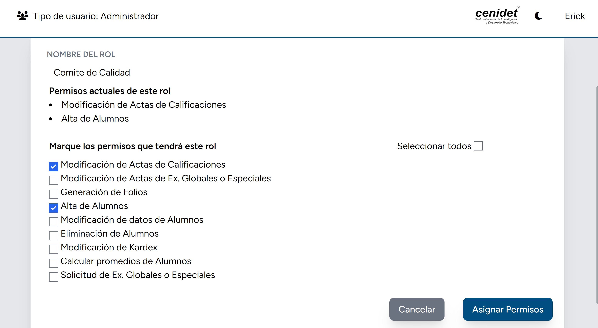
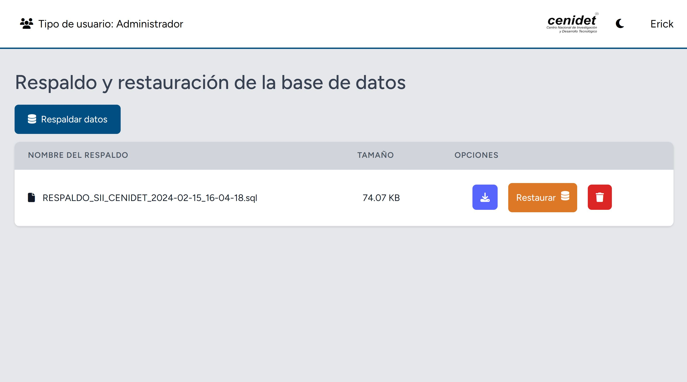
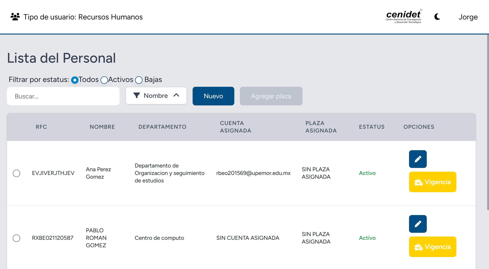
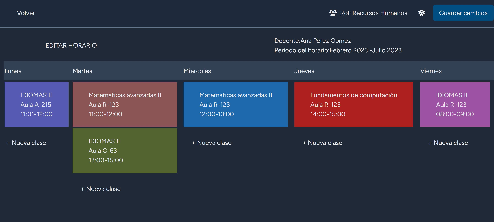
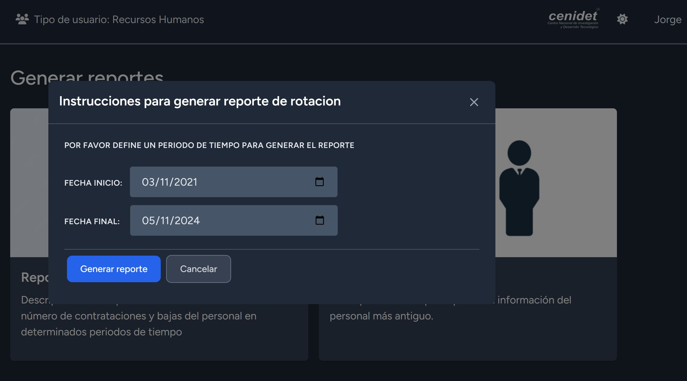
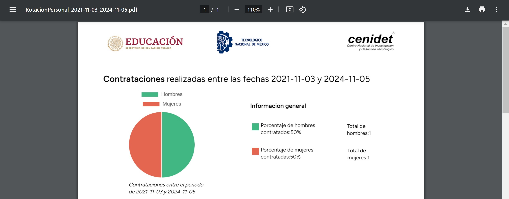

# **SII_CENIDET**

Sistema Integral web para Centro Nacional de Investigacion y Desarrollo Tecnologico, el cual consta de dos modulos principales uno enfocado al administrador del 
sitio y el segundo enfocada al personal de recursos humanos de la institucion.

Entre las funcionalidades principales se tienen:

## Modulo de administrador
1. Gestion de usuarios

2. Envio de avisos port medio de correo electronico a diferentes usuarios 

3.Gestion de permisos a los diferentes roles dentro del sistema

3.Respaldo y restauracion de Base de Datos (BD)

## Modulo de recursos humanos
1. Gestion del personal de la institución

2. Panel para creacion de horarios de docentes.

3. Generacion de reportes en PDF

Librerias utilizadas:
- [spatie/laravel-permission](https://github.com/spatie/laravel-permission/tree/main)
- [vue-charjs](https://github.com/apertureless/vue-chartjs)
  
El sistema esta desarrollado usando tecnologias como: 
1. Laravel
2. Vue js
3. Tailwind CSS

  

   
